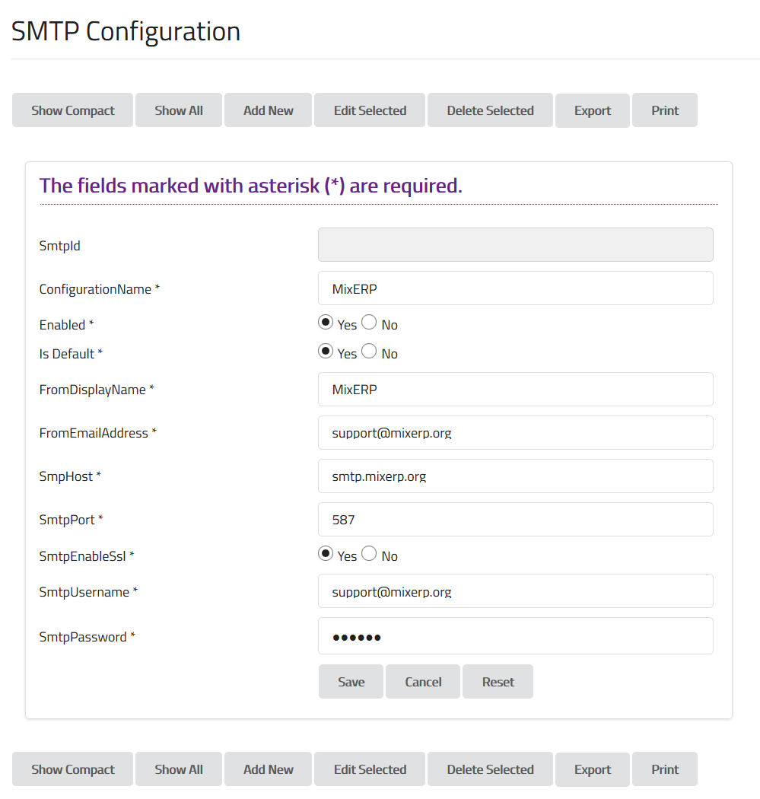

#MessagingParameters.xml

This configuration file is used by Messaging module to send and receive messages.

```sql
SELECT * FROM config.smtp;
```




**Configuration Name**

Enter an easy to remember SMTP configuration name.

**Enabled**

Set this to true in order to send emails from MixERP application.


**Is Default**

If you have multiple SMTP configurations, set this to true if you want to use this as the default
outgoing email configuration.

**From Display Name**

The display name of the from email address field.

**From Email Address**

The email address which will be used to send the outgoing emails.

**SMTP Host**

The DNS name or IP address of your SMTP server.

**SMTP Port**

The port on which your SMTP server accepts connection.

**SMTP Enable SSL**

Set this to true if you SMTP server uses a secure commmunication.

**SMTP Username**

The SMTP user name, generally the email address.

**Password**

The password of the above email address.


##Related Topics
* [Administrator Documentation](../admin.md)