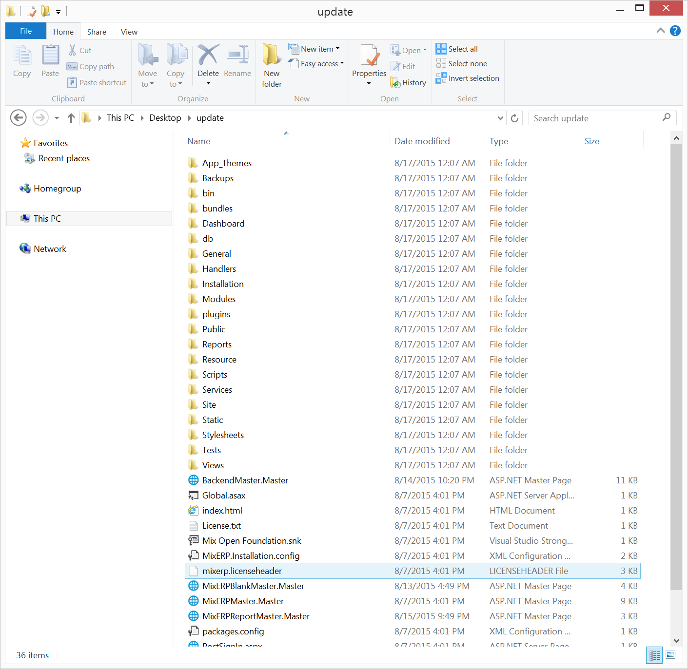
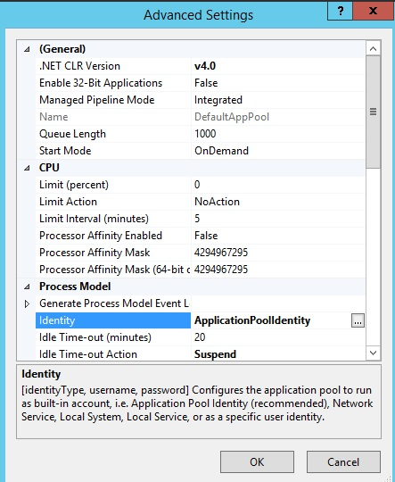

#Deploying MixERP on IIS

This document provides you relevant information regarding MixERP deployment and guides system administrators to properly setup MixERP in your organization.

##Download the Latest Release

Download the latest MixERP release from [GitHub](https://github.com/mixerp/mixerp/releases).




##Copy Extracted Directory to Application Server

This document assumes that MixERP application root directory is

<div class="ui label">C:\inetpub\wwwroot\mixerp\</div>

* Create a directory "mixerp" under "C:\inetpub\wwwroot\".
* Copy all the contents under the extracted directory to the application root.

##Create IIS Website

To create MixERP website in IIS, navigate to the "Sites" container.


Right click "Sites" and click "Add Website"


Now enter the following details:

<table>
    <tr>
        <th>
            Section
        </th>
        <th>
            Description
        </th>
    </tr>
    <tr>
        <td>
            Site Name
        </td>
        <td>
            The name of your MixERP Application, usually "mixerp".
        </td>
    </tr>
    <tr>
        <td>
            Application Pool
        </td>
        <td>
            A new application pool will be created if you do not select an already existing application pool. Do not select this.
        </td>
    </tr>
    <tr>
        <td>
            Physical Path
        </td>
        <td>
            The physical path where you copied the published directory to. In this document, it is <br />
            <p class="ui label">C:\inetpub\wwwroot\mixerp</p>
        </td>
    </tr>
    <tr>
        <td>
            Binding Type
        </td>
        <td>
            The binding type should be "https" and SSL certificate should be chosen. If you do not have SSL certificate, select "http".
        </td>
    </tr>
    <tr>
        <td>
            Binding IP Address
        </td>
        <td>
            Select "All Unassigned" unless you want to bind your MixERP Application to a specific IP Address.
        </td>
    </tr>
    <tr>
        <td>
            Binding Port
        </td>
        <td>
            Select "80" for port number unless you want to change the port binding of your MixERP Application to an unusual number.
        </td>
    </tr>
    <tr>
        <td>
            Binding Host Name
        </td>
        <td>
            If you have your DNS requests forwarded to your Application Server, put that in the host name section.
            If you leave this blank, you will have to access MixERP application using the Application Server IP Address or Network name.
        </td>
    </tr>
</table>


##Target App Pool .net Version
Once you are done creating the website, navigate to the "Application Pools" container in IIS. Find and double click
the application pool "mixerp".


Change the ".NET Framework Version" or ".NET CLR version" to "V.4.0.3019". Select the applicatication pool and click advanced settings.



Make sure that you select **ApplicationPoolIdentity**.

Done!


##Setting up Directory Permission

The following directories should be writable to the user account used by IIS for MixERP website.
Depending on the version of your IIS and Windows, it could be one of the following users:

* IIS_USRS
* Network Service
* IIS AppPool\mixerp

**Writable Directories**

<div class="ui yellow message">
    Skip this and continue with the next section if you want to apply restrictive file permission for your
    ERP instance.
</div>

MixERP can update itself when a new release is available. The update feature will
download, install, and patch your ERP instance to the latest version without needing you to sit next
to the operating system and do the update all by yourself. Be assured that you are notified
whenever there is a new update available. MixERP will update to the latest version
only when you click the button to do so.

To enable update, you must provide the following directories write access:

* C:\inetpub\www\mixerp
* [ApplicationLogDirectory--MixERP Configuration](../configs/mixerp.md)
* [TempPath--Updater.config](../configs/updater.config.md)


**Writable Directories (Strict mode)**

Allowing the write access only to the following directories is the minimum-required and
the most-restrictive permission you can configure for MixERP application.
Having said that, it does not allow you to update your instance of MixERP if a new release is available.

<table>
    <tr>
        <th style="min-width:380px;">
            Directory
        </th>
        <th>
            Description
        </th>
    </tr>
    <tr>
        <td>
            <a href="../configs/db-server.config.md">DatabaseBackupDirectory--DBServer.config</a>
        </td>
        <td>
            This directory is used to store database backups.
            You should not delete anything inside this directory.
        </td>
    </tr>
    <tr>
        <td>
            <a href="../configs/mixerp.md">ApplicationLogDirectory--MixERP Configuration</a>
        </td>
        <td>
            MixERP uses this directory to write log files.
            You should not delete anything inside this directory.
        </td>
    </tr>
    <tr>
        <td>
            C:\inetpub\wwwroot\mixerp\Resource\Temp
        </td>
        <td>
            MixERP uses this directory to temporarily save documents and images. It is absolutely safe to remove
            the files under this directory.
        </td>
    </tr>
    <tr>
        <td>
            C:\inetpub\wwwroot\mixerp\Resource\CustomReports
        </td>
        <td>
            This directory is used to automatically download and store new reports as they become
            available in our GitHub repository.
            You should not delete anything inside this directory.
        </td>
    </tr>
    <tr>
        <td>
            <a href="../configs/attachment-factory-parameters.md">AttachmentsDirectory--AttachmentFactory Parameters</a>
        </td>
        <td>
            This directory is used as a file-system repository of document attachments.
            You should not delete anything inside this directory.
        </td>
    </tr>
    <tr>
        <td>
            C:\inetpub\wwwroot\mixerp\Resource\Static\Emails
        </td>
        <td>
            This directory contains emails and is used as pickup directory for SMTP Server.
            You should not delete anything inside this directory.
        </td>
    </tr>
</table>


## Install PostgreSQL Server

You will need to install PostgreSQL Server, 9.3 or higher. Get the latest PostgreSQL server installer here:

[http://www.postgresql.org/download/](http://www.postgresql.org/download/)


## Create a New Database

Create a new PostgreSQL database, name it anything you want. 
Lowercase database name is preferred without any special character or symbol.

### Collation & Encoding
When you create your database, navigate to the tab "Definition". Make sure that you have the following settings:

* **Encoding**- UTF8
* **Template**- Template0
* **Collation**- C or POSIX
* **Character Type**- C or Posix


Select your newly created database, and then click **Tools** --> **Query Tool**

Now open the MixERP SQL Script from this location:

```C:\inetpub\wwwroot\mixerp\db\blank-db.sql```


Press F5.

## Securing Your PostgreSQL Database

Securing your installation is out of the scope of this article. However, keep in mind that 
MixERP creates the following restricted database roles:

* mix_erp
* report_user

**mix_erp**
* When this role is created, the default password is set to "change-on-deployment".
* You must change the password of this role. For more information, [click here](http://www.postgresql.org/docs/9.0/static/sql-alterrole.html)
* This user is the default database user of MixERP application

**report_user**
* When this role is created, the default password is set to "change-on-deployment".
* You must change the password of this role. For more information, [click here](http://www.postgresql.org/docs/9.0/static/sql-alterrole.html)
* The user used by MixERP ReportEngine Application for performing ad-hoc queries.
* This user **must have a readonly access** on the database.

Use these articles as a reference to secure your PostgreSQL installation:
* http://www.ibm.com/developerworks/library/os-postgresecurity/
* http://www.depesz.com/2007/08/18/securing-your-postgresql-database/
* http://www.mad-hacking.net/documentation/linux/applications/postgres/connection-permissions.xml
* http://dbaportal.eu/2013/11/11/securing-postgresql/


## Edit DBServer.config
Edit the configuration file [DBServer.config](../configs/db-server.config.md) to provide MixERP application
access to the database.


##Related Topics
* [Administrator Documentation](../admin.md)
