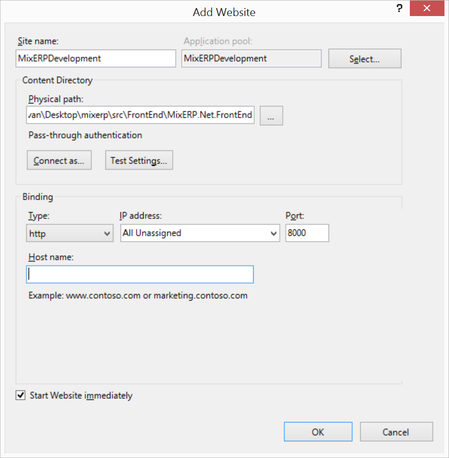
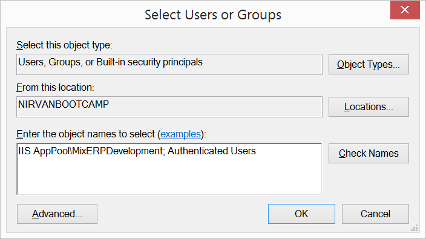
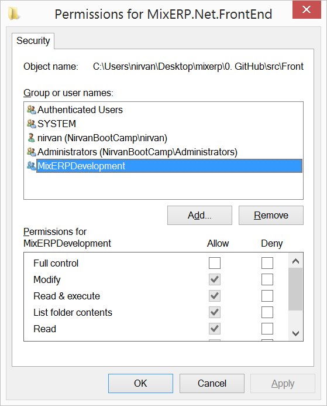

# Create IIS Application

Before you can debug MixERP on Visual Studio 2015, you must create
an IIS website using the following details.

### Site Name

MixERPDevelopment

### Application Pool Name

MixERPDevelopment

### Physical Path

The location where you cloned MixERP source code to.

<code>
    path-to-source\src\FrontEnd\MixERP.Net.FrontEnd
</code>

**Example**: C:\users\nirvan\Desktop\mixerp\src\FrontEnd\MixERP.Net.FrontEnd

### Port

8000

## Directory Permission

Provide the following users **modify** permission on the location where you cloned MixERP:

* IIS AppPool\MixERPDevelopment
* Authenticated Users

### Steps:

* Right click your IIS Application directory, and click Properties, and Security.
* Click on the Add button.
* Type **IIS AppPool\MixERPDevelopment; Authenticated Users** and click OK.
  
* For each user and select the checkbox "Modify" on the "Allow" category.

  
* Click OK.

## Complie MixERP

Open the solution in Visual Studio and perform a rebuild.

<code>
    path-to-source\src\MixERP.Net.sln
</code>

You can now view and debug MixERP on this address:

<a href="http://localhost:8000" target="_blank">http://localhost:8000</a>

##Related Topics
* [Developer Documentation](index.md).
* [MixERP User Guide](../user-guide/index.md)